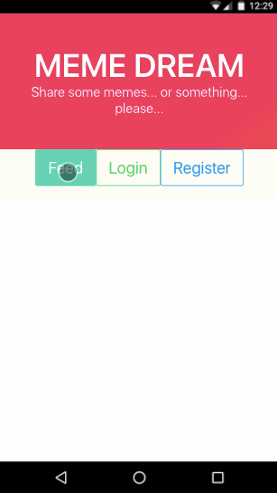

# meme_app
Meme Review App (React Front-End / Rails Back-End)

This is a responsive application for the web design to allow users to share their favorite memes or jokes with low-effort with a minimalistic design.

##

Single page application, rendering different views based on authentication status. 
Conditional rendering occurs based on user actions such as correct or incorrect actions.
Uses of React router, Bulma.io adjusted to be compatible with React, responsive design. 

## Video Walkthrough

Here's a walkthrough of implemented user stories:

GIFs created with [LiceCap](http://www.cockos.com/licecap/).

##

Heroku link: https://memes-app.herokuapp.com/

Few easter eggs... see if you can find them!

